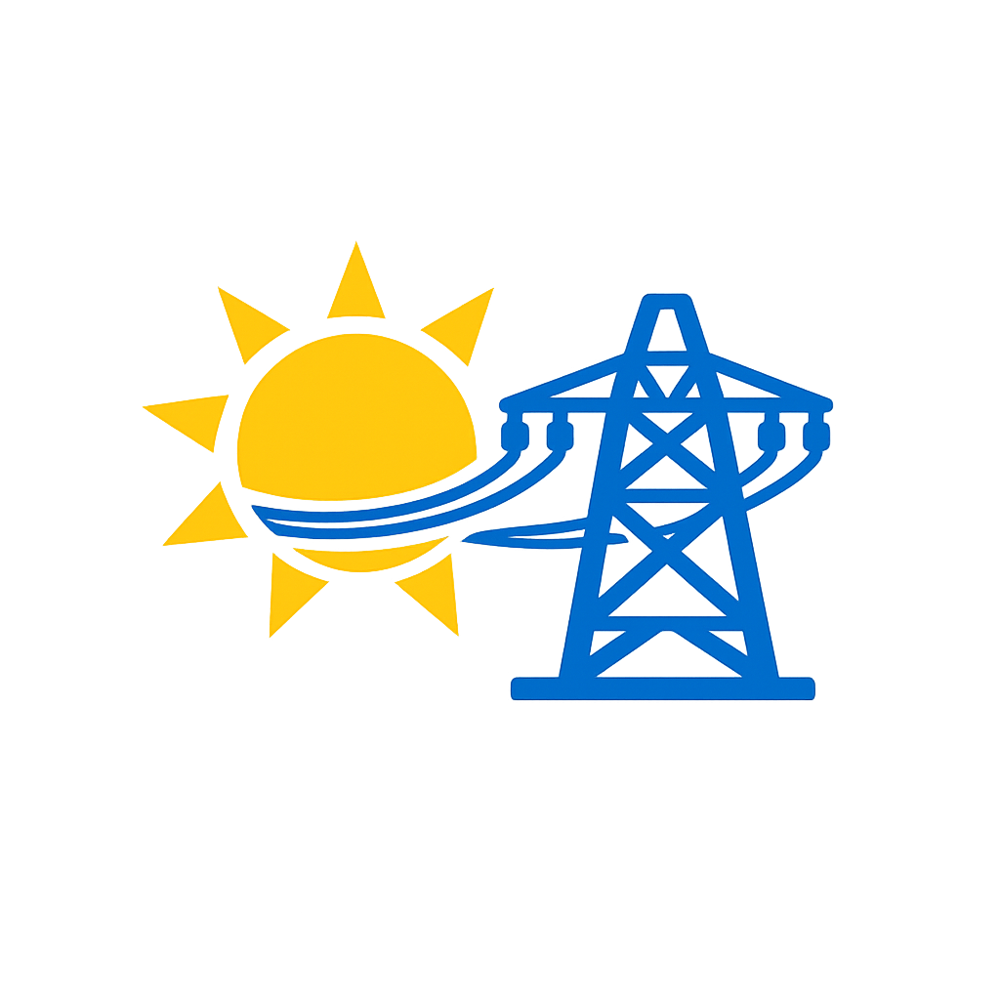

  

# Solaredge PV Export Limiter

> ⚠️ **SolarEdge only.** This integration is built specifically for **SolarEdge HD-Wave**
> inverters (SE-RW series) communicating over Modbus TCP via the
> [SolarEdge Modbus Multi](https://github.com/WillCodeForCats/solaredge-modbus-multi)
> integration. It will **not** work with Fronius, SMA, Huawei, Growatt, or any other brand.
> Other-brand support is explicitly out of scope.

> **Dynamic export limiting for SolarEdge inverters in Home Assistant** — keep grid feed-in
> below your chosen setpoint without sacrificing self-consumption. UI-installable, no YAML
> required.

## Why?

Many SolarEdge owners face one or more of:

- Energy supplier charges fees for surplus feed-in
- Grid voltage trips the inverter on sunny days (> 253 V in NL)
- Net-metering ends in 2027 (NL — saldering) and you want to maximize self-consumption now
- Dynamic tariff contracts with negative price hours

This integration solves all four with a single closed-loop controller: it reads your
household consumption from the P1 meter and your PV output from the SolarEdge Modbus
integration, then writes the optimal `active_power_limit` back to the inverter every
10 seconds.

## Features

- **UI-driven setup wizard** — pick your SolarEdge and P1 sensors from a dropdown, no YAML
- **6 modes**: Normal / Vacation / Negative-price / Wide / Manual / Off
- **Tariff-aware** via EnergyZero, Nordpool, Tibber, or any price sensor
- **Voltage protection** — pre-emptively limits when grid voltage exceeds 250 V
- **Failsafes** — sensor loss, HA restart, anomaly detection all reset to safe state
- **Curtailment counter** — see exactly how much PV energy you're holding back per day/month
- **Custom Lovelace card** — live energy flow, mode selector, history, all in one card
- **Dutch + English** UI translations
- **Built for SolarEdge HD-Wave** (SE-RW series), works with Modbus Multi integration

## Pre-requisites

Before installing, you need:

1. **Home Assistant** 2024.1 or newer
2. **HACS** installed ([install guide](https://hacs.xyz/docs/use/))
3. **SolarEdge Modbus Multi** integration installed via HACS
   ([repo](https://github.com/WillCodeForCats/solaredge-modbus-multi))
4. **Modbus TCP enabled** on your SolarEdge inverter (SetApp → Site Communication → Modbus)
5. A **P1 / DSMR smart meter** integrated into Home Assistant (built-in DSMR integration)

## Quick install

1. HACS → Integrations → ⋮ → Custom repositories → add this repo URL → Integration
2. Find "Solaredge PV Export Limiter" in HACS → Install → Restart HA
3. Settings → Devices & Services → Add Integration → "Solaredge PV Export Limiter"
4. Follow the wizard

## Documentation

- [Installation](docs/installation.md)
- [Configuration](docs/configuration.md)
- [Modes explained](docs/modes.md)
- [Tuning guide](docs/tuning.md)
- [Troubleshooting](docs/troubleshooting.md)
- [Architecture](docs/architecture.md) (for contributors)

## Screenshots

| Wizard | Dashboard | Curtailment |
|---|---|---|
|  |  |  |

## Contributing

Issues and PRs welcome. See [docs/architecture.md](docs/architecture.md) for the developer
guide.

## License

[MIT](LICENSE) — feel free to fork.

## Disclaimer

This integration writes to your inverter via Modbus. Misconfiguration could limit your
PV output below desired levels. The authors take no responsibility for energy lost or
inverter behavior. Test with the **Off** mode first to verify your sensor selection.
